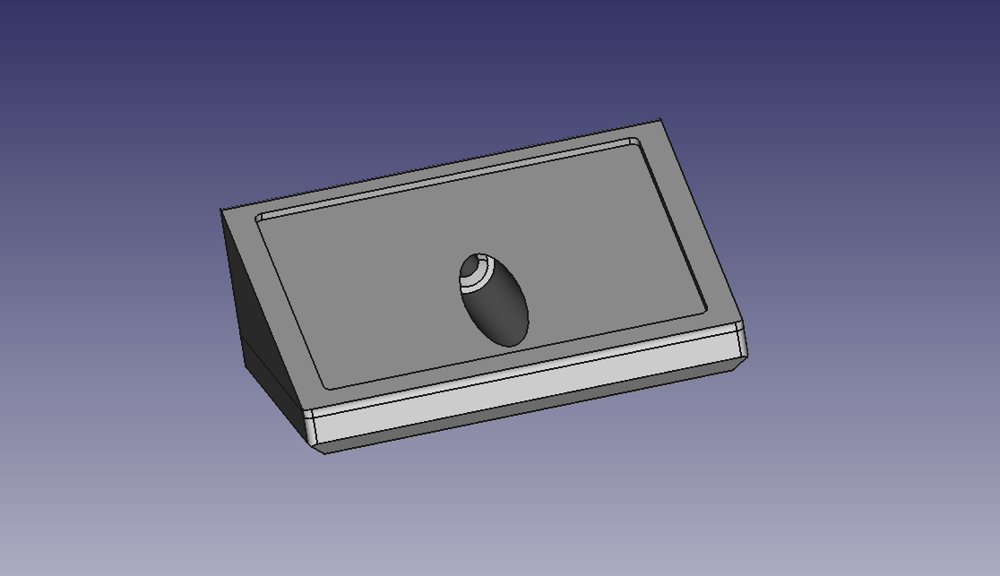
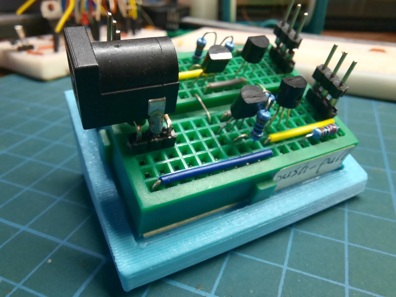

# Mini breadboard showcase

A mini showcase for circuits on a mini breadboard.

The size of mini breadboard: 47.8mm x 35.8mm (including the notch), 46mm x
34mm (excluding the notch), 17 columns of 10 holes, 8mm height (excluding the
double sided adhesive tape at the bottom), 9.5mm (including the double sided
adhesive tape at the bottom).
